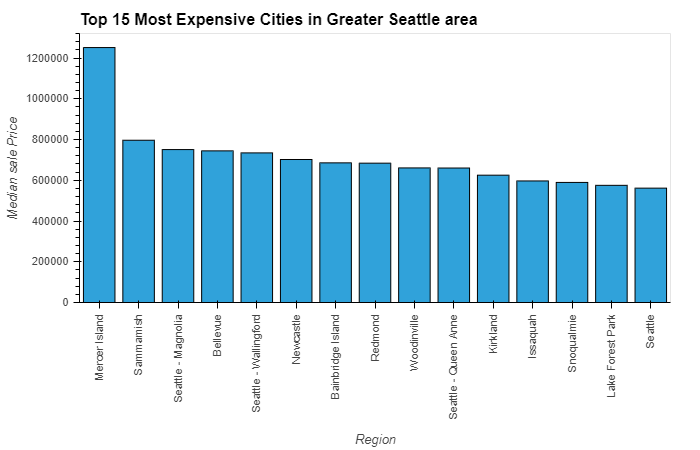
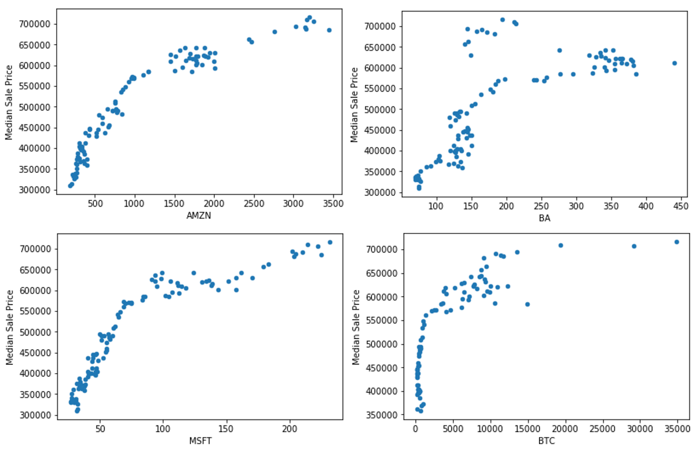
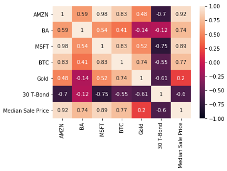
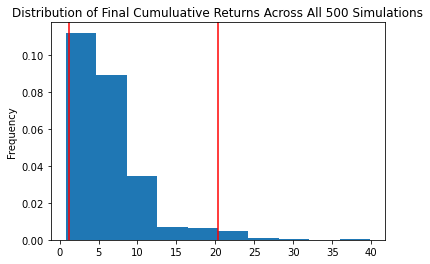
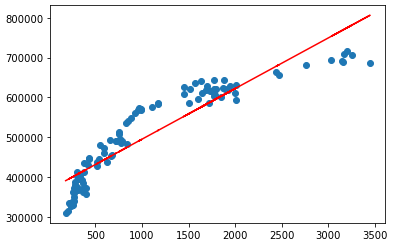

# Project 1 Brief - The Seattle Supersonic Housing Boom
Joanne Gates, John-Francis Kraemer, and Somya Panda

## Topic
What is fueling the Seattle housing boom and where will it lead?

## Questions:
### What specific Seattle neighborhoods and surrounding towns have experienced the greatest increase in housing prices in the past 10 years?
Researched Seattle housing data from RedFin (www.redfin.com/news/data-center/) that included 9 Seattle neighborhoods and 39 surrounding towns ("region(s)") based upon geographical area and where estimated employees commuted that worked at large Seattle companies.  RedFin provided historical median housing prices by month back until February 2012 through February 2021 ("measuring period").  The region with the largest housing price increase during the measuring period was Montlake Terrance with an average median housing price increase of >400%.  Moreover, the region with the largest average median housing price during the measuring period was Mercer Island with an estimated housing price of USD 800,000 in February 2012 and USD 1.6M in February 2021.

### What are the underlying companies, asset types, and datapoints propelling the Seattle real estate market and this immense increase in wealth?
Potential companies and asset types contributing to Seattle housing prices included large high growth companies either based or with significant operations/employment in Seattle.  These companies included Amazon, Boeing, Microsoft, Tableau, and Zulily.  Additional asset types included gold, 30-year treasury bond yields, and Bitcoin.  Historical prices were pulled from Alpaca, S&P Capital IQ, US Treasury, and Coinbase.  The data was then scrubbed and cleaned using Python. 

### Is there a strong individual correlation or weighted index correlation between these datapoints and Seattle housing prices?
The historical prices of the companies and asset classes over the same measuring period were plotted against historical median housing prices for the regions to calculate correlation.  Amazon (0.92), Boeing (0.74), Microsoft (.89), and Bitcoin (0.77) all had a strong positive liner correlation.  Gold, Tableau, and Zulily all had weak/minimal correlation, while 30-year Treasury Bonds had a moderately strong negative correlation of (-0.60).  Based on the high correlation of Amazon and Microsoft to median housing prices, it became evident that a weighted index of a combination of these companies/data types would not be necessary. 

### Can those datapoints be forecasted into the future?
Amazon was selected as the preeminent asset class because of its high correlation with Seattle median housing prices (0.92).  Using a Monte Carlo simulation with 500 iterations based on 5 years of historical stock data, the average estimated cumulative return of Amazon stock in 5 years was 609.4%.  Incorporating the closing price of Amazon stock of USD 3,372.20 (as of 4/9/21), the implied price of Amazon stock in 5 years is USD 23,923.33 (USD 3,372.20 * (1 + 6.094)).

 

### Can housing prices in Seattle be forecasted based on the future performance of these datapoints?
Seattle housing prices can be forecasted using Amazon stock price as proxy because of its high correlation (0.92) by calculating a linear regression analysis.  Importing the new Pandas libraries of [from sklearn.linear_model import LinearRegression] and [import statsmodels.api as sm] to calculate the trendline (y = m(x) +b) for a linear regression on 9 years of historical Amazon stock and Seattle housing prices.  This calculated a slope (m) of 127.11, a y-intercept (b) of 367,756 with an r squared of 0.84 (coefficient of determination).  The strength of the r squared of 0.84 comported with the correlation previously calculated of 0.92.  To test the linear equation, it was plotted with the Amazon stock price on 2/28/21 compared to the actual average Seattle median housing price on 2/28/21.  Amazon stock was at USD 3,000.46, using the linear equation, computed Seattle median housing prices were USD 749,144 = ((127 * 3,000.46) + 367,756) compared to actual Seattle median housing prices of USD 715,974.  Since the linear equation was reliable, it was then used to forecast future Seattle housing prices in 5 years based on the implied Amazon stock price in 5 years of USD 23,923.33, which calculated to an estimated median housing price in Seattle in 5 years of USD 3,408,774 = ((127 * 23,923.33) + 367,756).  Additional linear regression analysis were calculated for all of the 39 regions with their own unique slope coefficients and intercepts.  In conclusion, it is not suggested that Amazon stock is causing the increase in Seattle housing prices, simply that there is a high degree of correlation amongst both independent and dependent variables.  Also, it should be noted that there is a high degree of potential multicollinearity because the condition number in the linear regression is large, 2.15e+03.*  

Note:

*The condition number is formally defined as the value of the asymptotic worst-case relative change in output for a relative change in input

